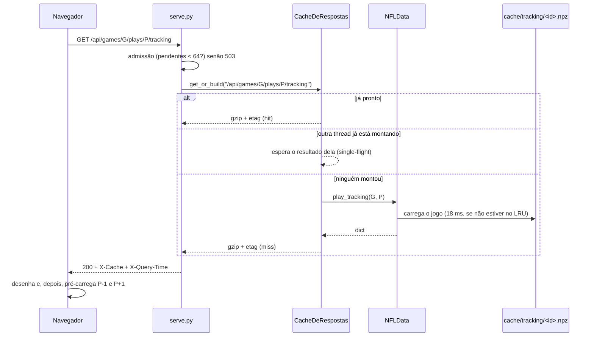

# Design Document

**Feature:** otimizacao-desempenho
**Workflow:** requirements-first
**Status:** aprovado
**Data:** 2026-09-24

---

## Overview

Os dados do app **não mudam enquanto o servidor está de pé**. Mesmo assim, hoje cada requisição refaz com pandas o mesmo trabalho pesado, e com 10 pessoas esse trabalho enfileira no único processo Python (o GIL permite uma thread de Python por vez). A solução tem quatro partes:
- **Guardar as respostas prontas** (já em JSON e gzip) na memória, calculando cada uma uma única vez, mesmo que 10 pessoas peçam o mesmo jogo no mesmo instante.
- **Pré-aquecer esse cache** em segundo plano logo depois que o servidor sobe.
- **Ler o tracking de um formato binário por jogo**, 5× mais rápido que o CSV, e montar a resposta da jogada sem `iterrows`.
- **Ajustes no navegador:** chamadas iniciais em paralelo, pré-carga das jogadas vizinhas, descarte de respostas atrasadas e reaproveitamento dos arquivos estáticos entre visitas.

Nenhuma regra de cálculo muda. Um teste de "foto" (golden) compara todas as respostas antes e depois.

---

## Diagnóstico (medido em 2026-09-24)

Serve de base para as decisões abaixo. Perfil de CPU por requisição, com 1 usuário:

| Rota | Tempo | Onde vai o tempo |
|---|---|---|
| `GET /api/games/{id}` | 110 ms (230 ms com o profiler) | ~40% em `_tendencies` e ~40% em `insights`: dezenas de `groupby().agg()` pequenos, com overhead fixo do pandas |
| `.../tracking`, primeiro acesso ao jogo | ~150 ms | ~95 ms lendo o CSV do jogo (6,8 MB) + montagem do JSON |
| `.../tracking`, jogo já em memória | ~50 ms | ~50% em `iterrows` (1.079 linhas viram `Series`) + `play()` + um filtro que varre `self.timing` inteiro |

Com 10 usuários, cada sessão consome ~400 ms de CPU e as 20 sessões ficam em fila no mesmo processo (~8 s no total). Isso bate com os 8,5 s medidos. **O gargalo é CPU repetida, não disco nem rede.**

Com 25 usuários, as conexões recusadas vêm do `ThreadingHTTPServer`, que aceita por padrão uma fila de só **5** conexões pendentes (`request_queue_size = 5`).

---

## Architecture

### Visão de alto nível

```
Navegador (app.js)
  │  boot em paralelo · pré-carga das vizinhas · descarta resposta atrasada
  │  arquivos estáticos com ETag (304 na 2ª visita)
  ▼
serve.py ── controle de admissão (fila de 128, até 64 pendentes, depois 503)
  │
  ├── CacheDeRespostas ── hit ──► bytes gzip prontos (≈0 ms)
  │        │ miss (uma única construção por chave)
  │        ▼
  └── NFLData (data_layer.py) ── lógica atual, intocada no conteúdo
           │
           └── tracking ◄── cache/tracking/<gameId>.npz  (fallback: CSV original)
                                  ▲
etl/build_metrics.py ── prepara só os jogos novos/alterados (manifest.json)
```

### Fluxo de interação: abrir uma jogada na prancheta



### O que já existe e será reusado

- `NFLData` em `server/data_layer.py`: toda a lógica de negócio (ratings, insights, narração). **O conteúdo das respostas não é reescrito.** Só mudam a leitura do tracking e a montagem de `play_tracking`.
- `Router`, `ApiError` e `_send_bytes` em `server/serve.py`: o roteamento, a validação de parâmetros (`_int_param`) e o gzip já existem. O cache se encaixa em `_handle_api`.
- O LRU `_tracking_cache` em `NFLData`: continua, só passa a carregar de `.npz` e aumenta de 6 para 12 jogos.
- O cache `get()` em `app/js/app.js`: já deduplica chamadas iguais na sessão. A pré-carga reusa esse cache.
- O cálculo de métricas em `etl/build_metrics.py` (`process_game`) já trabalha por jogo. Só a gravação muda.
- `X-Query-Time`, que já existe e atende o NFR 2.

---

## Components and Interfaces

### 1. CacheDeRespostas (`server/response_cache.py`, novo)

**Responsabilidade:** devolver a resposta pronta (JSON + gzip + ETag) de uma chave, construindo-a uma única vez mesmo sob concorrência.
**Atende aos requisitos:** 1.1, 1.3, 1.5, 4.2, 5.3, 6.5

```python
@dataclass(frozen=True)
class Resposta:
    gz: bytes          # corpo JSON já comprimido
    raw_size: int
    etag: str          # sha1 do JSON, entre aspas

class CacheDeRespostas:
    def __init__(self, max_bytes: int = 128 * 2**20): ...
    def get_or_build(self, key: str, build: Callable[[], object]) -> tuple[Resposta, bool]:
        """(resposta, hit). Se outra thread já está construindo a mesma key,
        espera por ela. Se build() lança, a exceção vai para todos os que
        esperavam e nada é guardado."""
    def aquecer(self, tarefas: Iterable[tuple[str, Callable[[], object]]]) -> None:
        """Roda em thread daemon, na ordem dada, e cede CPU entre as tarefas."""
    def stats(self) -> dict  # itens, bytes, hits, misses
```

- **Chave** = caminho + query **normalizada** (parâmetros ordenados). Assim `?a=1&b=2` e `?b=2&a=1` caem no mesmo item.
- **Limite:** LRU por bytes do gzip (128 MB, na prática ~12 KB por tracking). Os 8.557 trackings somados cabem em ~85 MB.
- **Só entram respostas 200.** Um 404 ou erro nunca vai para o cache.
- **Aquecimento, em ordem:** `meta`, `games` de cada semana e depois, para os 122 jogos (semana 1 primeiro, que é a tela padrão): `game`, `plays` e `broadcast`. São ~16 s de CPU em segundo plano. O tracking **não** é aquecido: é caro demais para pré-montar e a pré-carga do navegador cobre a navegação.

### 2. Admissão e arquivos estáticos (`server/serve.py`, alterado)

**Responsabilidade:** aceitar conexões sem recusar, recusar trabalho com 503 quando lotado e servir os estáticos com revalidação.
**Atende aos requisitos:** 1.2, 1.4, 4.3, 4.4, S.1, S.2, S.3, S.4

```python
class Server(ThreadingHTTPServer):
    request_queue_size = 128          # antes: 5 (herdado do socketserver)
    daemon_threads = True

MAX_PENDENTES = 64                    # requisições /api em processamento ao mesmo tempo
# Handler._handle_api:
#   if not _vagas.acquire(blocking=False): raise ApiError(503, "servidor ocupado, tente novamente")  + Retry-After: 2
#   try: resp, hit = CACHE.get_or_build(chave, lambda: fn(query, params)) finally: _vagas.release()
#   headers: X-Cache: HIT|MISS, X-Query-Time, ETag
# Handler._handle_static:
#   ETag = sha1(bytes) guardado por (caminho, mtime_ns); Cache-Control: no-cache
#   If-None-Match igual -> 304 sem corpo
```

- **Correção de segurança junto:** a checagem atual `str(target).startswith(str(APP_DIR))` deixa passar uma pasta vizinha chamada `app2/`. Ela passa a ser `target.is_relative_to(APP_DIR)`. A checagem acontece **antes** de qualquer consulta ao cache de ETag (S.1).
- A validação de parâmetros (`_int_param`) continua **antes** de o cache ser consultado. Uma entrada inválida nunca vira chave (S.2).
- A API continua com `Cache-Control: no-store`. Quem deduplica é o cache em memória do navegador (`get()`).

### 3. Leitura de tracking (`server/data_layer.py`, alterado)

**Responsabilidade:** entregar os quadros de uma jogada a partir do formato binário, com o mesmo JSON de hoje.
**Atende aos requisitos:** 2.1, 2.2, 2.3, 2.4, 2.5

```python
def _tracking_for_game(self, game_id: int) -> pd.DataFrame | None:
    """1º cache/tracking/<id>.npz; se faltar ou estiver ilegível, loga aviso
    e cai no CSV original; se nenhum existir -> None (404 como hoje)."""

def play_tracking(self, game_id, play_id) -> dict | None:
    # mesmo contrato de saída. Mudanças internas:
    #  - sub = df[df.playId == play_id] via índice por playId (groupby pré-calculado no LRU)
    #  - quadros montados com numpy (lexsort por nflId, frameId + searchsorted),
    #    arredondamento com round() do Python para garantir valores idênticos
    #  - timing por dict {(gameId, playId): linha} em vez de varrer self.timing
```

- ~~`snap_formation` passa a usar `play_tracking` via cache~~ **(cortado na execução):** o cache guarda bytes gzip, não dicionários. Com o `play_tracking` novo, a formação já custa ~7 ms.
- **Ajustes feitos na execução (tarefa 6):**
  - O codec do `.npz` ficou num módulo próprio, `server/tracking_npz.py`, compartilhado pelo ETL e pelo servidor.
  - O texto é gravado como **categoria** (códigos + valores). A versão em unicode por célula levava 56–73 ms para ler; a de categorias leva ~22 ms, com os mesmos valores.
  - `play_participants` e `players_list` trocaram `iterrows` por `to_dict("records")`. Os participantes passaram a vir de uma tabela estreita por jogo, com índice por jogada.
- **Arredondamento:** `np.round` e o `round()` do Python podem divergir em casos de meio-termo. Por isso a conversão final usa `round()` do Python sobre `ndarray.tolist()`. São ~5.500 números por jogada, ~1 ms.

### 4. Preparação incremental (`etl/build_metrics.py`, alterado)

**Responsabilidade:** garantir que o cache esteja completo e atualizado, processando só os jogos novos ou alterados.
**Atende aos requisitos:** 6.2, 6.3, 6.4, restrição de novas fontes de partidas

```python
ETL_VERSION = 2

def ensure_cache(data_dir: Path, cache_dir: Path, progress: Callable[[str], None] = print) -> Relatorio:
    """Compara manifest.json com os CSVs de tracking. Para cada jogo novo,
    alterado (tamanho/mtime) ou com arquivo faltando, roda process_game e
    grava as partes do jogo. Depois, se algo mudou, reconcatena os agregados
    play_timing.csv e player_play.csv a partir das partes (sem reprocessar)."""

@dataclass
class Relatorio:
    processados: list[int]; reaproveitados: int; segundos: float
```

- `serve.py` chama `ensure_cache` **antes** de carregar `NFLData`. Assim, `python server/serve.py` sozinho já funciona na primeira vez, e o `RODAR.bat` fica mais simples.
- `python etl/build_metrics.py --force` continua existindo e reprocessa tudo.

### 5. Cliente (`app/js/app.js` e `app/index.html`, alterados)

**Responsabilidade:** reduzir a espera percebida sem mudar nada do que é exibido.
**Atende aos requisitos:** 3.1, 3.2, 3.3, 3.4, 4.1, 4.5, 5.1, 5.2

```js
// boot: meta e games da semana em paralelo; depois o detalhe do jogo.
const [meta, games] = await Promise.all([api.meta(), api.games({ week })]);

// "só o último vence": cada fluxo concorrente tem um contador.
const seq = { play: 0, scout: 0 };
async function coachLineup() { const my = ++seq.play; ...; const tr = await api.tracking(g, p); if (my !== seq.play) return; ... }

// pré-carga: só depois de desenhar a jogada atual; erros são engolidos (3.3).
function prefetchVizinhas() { [idx - 1, idx + 1].forEach((i) => list[i] && api.tracking(g, list[i].playId).catch(() => {})); }

// cache get(): limitado a 150 entradas (LRU), para não crescer sem fim numa sessão longa.
```

- **Fontes:** `<link rel="preload" as="style" onload="this.rel='stylesheet'">` com `<noscript>` de fallback. Com `display=swap`, que já existe, a página não espera o Google Fonts (4.5).
- **Pré-carga e prioridade (3.4):** ela só dispara depois que a jogada escolhida foi desenhada, e no máximo 2 pedidos por vez. Assim a jogada escolhida nunca disputa conexão com a pré-carga.

### 6. Ferramentas de verificação (`tests/` e `tools/`, novos)

**Responsabilidade:** provar que nada mudou (golden) e medir as metas (NFR 1).
**Atende aos requisitos:** 6.1, NFR 1, e a medição de todos os critérios de tempo

- `tools/golden.py capture|check`: grava o **hash SHA-256 do JSON canônico** (`sort_keys`) de cada URL de uma lista fixa. A lista cobre `meta`, `games` de todas as semanas, os 122 `game`, `plays` e `broadcast`, `tracking` e `formation` de todas as jogadas de 5 jogos mais 3 jogadas de cada um dos outros jogos, e `players`, `player`, `compare` e `leaders` com filtros variados. Guarda só os hashes (~100 KB), não o conteúdo.
- `tools/bench.py`: gera a tabela de linha de base do requirements.md (1 usuário, por rota).
- `tools/carga.py --usuarios 10`: a sessão típica em paralelo, com p50, p95 e taxa de erro e conexão recusada.

> **Teste de corte:** considerei pôr o cache dentro de `NFLData`, com um decorator por método. Isso cobriria o JSON, mas não os bytes gzip nem o ETag, e espalharia a regra por 11 métodos. Um cache só, na borda HTTP, é menos código e atende os mesmos requisitos. Ficou na borda.

---

## Data Model

Nada no banco (não há banco). Arquivos em `cache/`, todos derivados e regeneráveis:

| Arquivo | Conteúdo | Obrigatório | Observação |
|---|---|---|---|
| `cache/manifest.json` | `{"etlVersion": 2, "games": {"<gameId>": {"size": int, "mtimeNs": int}}}` | sim | se `etlVersion` mudar, tudo é reprocessado |
| `cache/tracking/<gameId>.npz` | colunas `playId, nflId, frameId, jerseyNumber, team, playDirection, x, y, s, a, o, dir, event` (numéricas em float64/int64, texto em unicode numpy) | sim | `savez_compressed`, lido com `allow_pickle=False` |
| `cache/parts/<gameId>.timing.csv` | linhas de `play_timing` do jogo | sim | fonte da verdade por jogo |
| `cache/parts/<gameId>.motion.csv` | linhas de `player_play` do jogo | sim | fonte da verdade por jogo |
| `cache/play_timing.csv`, `cache/player_play.csv` | concatenação das partes | sim | mesmo formato de hoje: `NFLData._load` não muda |

**Em memória (não persiste):** o CacheDeRespostas (até 128 MB) e o LRU de tracking (12 jogos × ~6 MB).

**Migração necessária:** não. Na primeira subida com a versão nova, `ensure_cache` não encontra `manifest.json` e prepara tudo (estimativa: ~45 s; teto do requisito: 90 s). O `cache/` antigo é sobrescrito.

---

## Error Handling

| Falha | Detecção | Resposta | Requisito |
|---|---|---|---|
| Mais de 64 requisições `/api` em processamento | o semáforo não tem vaga | `503 {"error": "servidor ocupado, tente novamente"}` + `Retry-After: 2`; nada é calculado | 1.4, S.3 |
| Mais de 128 conexões esperando accept | fila do SO cheia | só acontece bem acima da carga-alvo. O limite de 64 dá 503 antes disso | 1.2, 1.4 |
| Exceção ao construir uma resposta | `build()` lança | 500 para quem pediu e para quem esperava a mesma chave. Nada é guardado, então a próxima tentativa recalcula. As outras threads não são afetadas | 1.5 |
| Jogada sem tracking | `sub.empty` | 404 "tracking indisponível", como hoje (não vai para o cache) | 2.4 |
| `.npz` ausente ou corrompido | `FileNotFoundError` / `BadZipFile` / `ValueError` no `np.load` | log `[aviso]`, lê o CSV original e responde normalmente. **(ajuste da execução)** O `.npz` ruim é apagado, para o `ensure_cache` da próxima subida regenerá-lo; sem isso ele ficaria para sempre, porque o CSV de origem não mudou | 2.5 |
| `.npz` e CSV ausentes | os dois caminhos falham | 404 "tracking indisponível" só para esse jogo | 2.5 |
| Pré-carga de vizinha falha | `promise` rejeitada | engolida em silêncio. O `get()` remove a entrada e a jogada é buscada de novo se escolhida | 3.3 |
| Resposta de jogada ou busca antiga chega depois da atual | contador `seq` diferente | descartada sem tocar no DOM | 3.2, 5.2 |
| Estático mudou desde a última visita | ETag diferente do `If-None-Match` | 200 com o arquivo novo | 4.4 |
| Google Fonts inacessível | o `onload` nunca dispara | a página já está desenhada com a fonte do sistema | 4.5 |
| Cache incompleto, desatualizado ou de outra versão | `ensure_cache` compara tamanho, mtime e `etlVersion` | reprocessa só os jogos afetados antes de servir, com progresso no terminal | 6.4 |
| Caminho fora de `app/` | `is_relative_to` falso | 403 antes de ler arquivo ou cache | S.1 |
| Parâmetro inválido | `_int_param` lança | 400 antes de consultar cache ou dados | S.2 |

---

## Segurança

- **Autenticação e autorização:** não há (app somente leitura). O padrão continua `127.0.0.1` (S.4) e o aviso do `--host 0.0.0.0` continua.
- **Validação de entrada:** a mesma de hoje (`_int_param` e limites de `limit`), executada antes do cache. A chave do cache só é montada com parâmetros já validados e normalizados, então não existe forma de encher o cache com variações arbitrárias de query. Parâmetros desconhecidos são descartados da chave.
- **Esgotamento de recursos:** o semáforo de 64 e o teto de 128 MB do cache limitam memória e CPU sob rajada (S.3).
- **Formato do cache:** o `.npz` é lido com `allow_pickle=False`, então um arquivo adulterado em `cache/` não executa código. Foi um dos motivos para descartar pickle.
- **Arquivos estáticos:** a correção do `startswith` para `is_relative_to` fecha um caso de path traversal que existe hoje.

---

## Testing Strategy

Ferramenta: `pytest` (dependência nova, só de desenvolvimento). Os scripts atuais (`smoke_test.py` e `ui_test*.py`) continuam.

| Nível | O que cobre | O que é simulado |
|---|---|---|
| Unitário | CacheDeRespostas: hit/miss, single-flight com 10 threads na mesma chave (1 construção só), exceção propagada sem guardar, LRU por bytes. `ensure_cache`: jogo novo, jogo alterado, `.npz` apagado, `etlVersion` diferente | `build()` falsos; pasta temporária com 2 CSVs pequenos |
| Integração | servidor real em porta livre: 503 com vagas esgotadas, 304 com ETag, 403 com `../` e com `app2`, 400 com parâmetro inválido, X-Cache HIT na 2ª chamada, fallback para CSV com `.npz` corrompido | nada, usa o dataset real |
| Regressão (golden) | `tools/golden.py check`: todos os hashes iguais aos capturados **antes** de qualquer mudança | nada |
| Desempenho | `tools/bench.py` e `tools/carga.py --usuarios 10` contra as metas | nada |
| Navegador (headless) | `tests/test_ui.py` com **Playwright usando o Edge já instalado** (`channel="msedge"`, sem baixar navegador; dependência só de dev). O `ui_test_all.py` só faz `--dump-dom` e não consegue clicar, medir tempo nem atrasar respostas. Ele continua como teste de fumaça. Cobre: boot em paralelo, jogada vizinha servida do cache do navegador, busca cuja resposta antiga chega depois da nova e não aparece na tela | a latência é simulada no JS: o `fetch` é embrulhado para atrasar a 1ª resposta |
| Manual | a prancheta continua idêntica visualmente, a fonte cai para a do sistema offline e a segunda visita mostra 304 no DevTools | |

**Critério de pronto:** todo critério do requirements.md tem um teste nomeado no mapa de cobertura do `tasks.md`.

---

## Decisões e alternativas descartadas

### Decisão 1: formato do tracking pré-processado (a Q3 do requirements)

Medido em 10 jogos reais (71 MB de CSV):

| Opção | Leitura por jogo | Disco extra (122 jogos) | Dependência | Valores idênticos? |
|---|---|---|---|---|
| A. Continuar lendo o CSV | 102 ms | 0 | — | sim |
| B. Pickle do DataFrame | 19 ms | ~730 MB | — | sim, mas executa código ao ler e quebra ao trocar a versão do pandas |
| **C. `.npz` comprimido, float64** | **18 ms** | **~123 MB** | nenhuma (numpy já vem com o pandas) | **sim (verificado bit a bit)** |
| D. Parquet (zstd) | ~15–25 ms (estimado) | ~100–150 MB (estimado) | `pyarrow` (~100 MB instalado) | sim |

**Escolha:** C.
**Motivo:** a opção A não atinge o critério 2.1 (60 ms no primeiro acesso). A opção C atinge com folga, foi medida (não estimada), é segura de ler e não adiciona dependência. É um arquivo por jogo, então uma partida nova de outra API vira só mais um arquivo.
**Custo aceito:** ~123 MB a mais em disco, cerca de 15% do dataset. O cache atual de métricas (10 MB) continua como está, porque ajuda e é barato.
**Quando rever:** na spec de integração com APIs. Se os dados externos vierem em Arrow ou Parquet, a opção D passa a fazer sentido, e trocar o formato fica isolado em `_tracking_for_game` e `ensure_cache`.

### Decisão 2: cache de respostas na borda HTTP, e não otimizar `insights`/`_tendencies`

**Alternativas consideradas:** reescrever `insights` e `_tendencies` com agregações vetorizadas para a liga inteira no startup; cache em cada método do `NFLData`; cache de respostas na borda.
**Escolha:** cache na borda, com aquecimento.
**Motivo:** os dados são imutáveis durante a vida do processo. Reescrever `insights` mexe na lógica de negócio, que é exatamente o que o requisito 6.1 protege, para ganhar algo que o cache dá de graça depois do primeiro acesso.
**Custo aceito:** nos ~16 s depois do startup, um jogo ainda não aquecido custa os 110 ms de hoje (ver Riscos).

### Decisão 3: um processo com threads, sem múltiplos processos

**Alternativas consideradas:** vários processos workers (contornam o GIL); trocar para outro servidor HTTP (uvicorn, waitress).
**Escolha:** manter o `ThreadingHTTPServer`.
**Motivo:** com o cache, uma requisição típica gasta menos de 1 ms de CPU e o GIL deixa de ser gargalo para 10 usuários. Vários processos multiplicariam a memória (cada um carregaria ~260 MB de dados) e complicariam o `RODAR.bat`.
**Custo aceito:** o teto de escala é de uma máquina e um processo. Isso é suficiente para a meta e está fora de escopo passar disso.

### Decisão 4: arquivos estáticos com ETag, e não nome versionado

**Alternativas consideradas:** `app.3f9a.js` com cache de 1 ano (exige etapa de build); ETag + `no-cache`.
**Escolha:** ETag.
**Motivo:** o requisito proíbe etapa de build. A revalidação custa uma ida e volta com resposta 304 vazia, desprezível localmente.
**Custo aceito:** uma requisição de revalidação por arquivo a cada visita.

### Outros cortes feitos nesta revisão

- **Pré-montar todas as respostas de tracking em disco** (8.557 JSONs): cortado. O `.npz` com montagem em ~5 ms já atinge 2.1, sem mais um formato para invalidar.
- **Cache HTTP (ETag) também na API:** cortado. O cache `get()` do navegador já evita repetir chamadas dentro da sessão, e nenhum requisito pede reaproveitar a API entre visitas.
- **Service worker / modo offline:** cortado. Não há requisito.
- **Comprimir o formato do tracking na rede** (arrays em vez de listas): cortado. Com gzip a resposta tem ~10 KB, e mudar o formato quebraria o contrato do 6.1.

---

## Riscos

| Risco | Impacto | Mitigação |
|---|---|---|
| A reescrita de `play_tracking` muda um número na 2ª casa decimal ou a ordem de um campo | alto | golden capturado **antes** da primeira mudança; `round()` do Python; o hash é do JSON canônico, então a ordem de chaves não conta, mas a de listas conta |
| O aquecimento em segundo plano disputa CPU com os primeiros usuários logo após o startup | médio | aquece a semana 1 primeiro, cede CPU entre tarefas; banca abre o app com o servidor já de pé há mais de 20 s; o log avisa quando o aquecimento termina |
| O primeiro preparo (~45 s estimados) passa de 90 s em máquina mais lenta | médio | o progresso aparece no terminal; se passar, a tarefa de ETL paraleliza por jogo com `ProcessPoolExecutor`, porque cada jogo é independente |
| **(medido na execução, 9.1; resolvido em 9.2)** No teste **sem pausa** entre cliques, a meta 1.1 ficou instável: p95 de 393, 347, 289, 288 e 263 ms (3 de 5 dentro). O José decidiu medir o cenário do requisito, com pausa de 1–2 s (requirements v0.3), e aí deu 5 de 5 dentro (p95 37–42 ms). O sem pausa continua como teste de estresse. O custo restante é descomprimir o `.npz` (~22 ms) de cada jogo aberto pela 1ª vez, que enfileira quando 10 pessoas abrem jogos diferentes no mesmo segundo | médio | numa banca real, as pessoas tendem a olhar o mesmo jogo (o cache de respostas absorve); se virar problema, a opção é pré-carregar o tracking do jogo quando o detalhe dele é aberto |
| A pré-carga aumenta a carga no servidor com 10 usuários (até 3× pedidos de tracking) | baixo | é medida no teste de carga com a pré-carga ligada; o limite é de 2 vizinhas por vez |
| O disco do usuário não tem os ~123 MB extras | baixo | sem o `.npz`, o fallback para CSV mantém o app funcionando, só mais lento |

---

## Aprovação

- [x] Todo requisito do requirements.md está atendido por algum componente
- [x] Nenhum componente existe sem requisito que o justifique
- [x] Todo SE...ENTÃO aparece na tabela de erros
- [x] Pelo menos um componente foi cortado na revisão (cache por método, JSONs de tracking em disco, ETag na API, service worker, formato compacto de rede)
- [x] Decisões relevantes registradas com alternativa descartada
- [x] Decisão 1 (Q3: formato e disco do cache) confirmada pelo time: opção C, aceitando ~123 MB a mais em disco em troca da experiência

**Aprovado por:** José Cota em 2026-09-24
